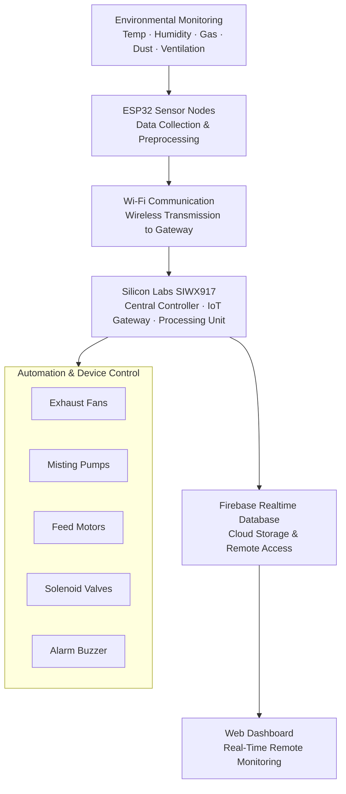

# PoultryConnect — IoT-Based Poultry Monitoring and Automation

## 1. Project Overview

### Description

PoultryConnect is an IoT-based smart poultry monitoring and automation system designed to improve poultry farm management, environmental monitoring, and automation using Silicon Labs wireless technology.

The system uses the **Silicon Labs SIWX917 development board** as the central controller, processing unit, and IoT gateway of the poultry automation system. The SIWX917 receives environmental data from distributed **ESP32-based sensor nodes** deployed across different poultry zones and performs centralized monitoring, decision-making, automation control, and cloud connectivity.

The system continuously monitors poultry farm conditions such as temperature, humidity, harmful gas concentration, dust levels, and ventilation quality. Based on environmental conditions and predefined thresholds, the SIWX917 automatically controls farm equipment such as exhaust fans, misting pumps, feed systems, solenoid valves, and alarm systems.

PoultryConnect integrates cloud-based monitoring using Firebase Realtime Database, allowing poultry farmers to remotely monitor real-time poultry farm conditions through a web dashboard and improve operational efficiency.

### Target Users

* Poultry farmers
* Poultry farm operators
* Smart poultry management systems
* Agricultural automation applications

### Why This Project Exists

Manual poultry farm monitoring is time-consuming, inefficient, and may lead to delayed responses during unhealthy environmental conditions.

PoultryConnect aims to reduce manual intervention, improve poultry farm management, automate environmental control, enable remote monitoring, and improve poultry safety and farm efficiency through IoT-based automation.

---

## 2. Technical Architecture

### System Architecture

### Technical Architecture (Workflow)

1. **Environmental Monitoring**
   Multiple sensors are deployed across poultry farm zones to continuously monitor environmental conditions such as temperature, humidity, harmful gases, dust concentration, and ventilation quality.

2. **Sensor Data Collection (ESP32 Sensor Nodes)**
   ESP32-based sensor nodes collect environmental data from connected sensors and preprocess readings for wireless transmission.

3. **Wireless Communication (Wi-Fi)**
   Sensor nodes transmit collected data wirelessly to the **Silicon Labs SIWX917 development board** using Wi-Fi communication.

4. **Centralized Processing and Decision Making (SIWX917)**
   The **Silicon Labs SIWX917 development board** acts as the central controller, IoT gateway, and processing unit of the system. It analyzes incoming sensor data, compares readings with predefined environmental thresholds, and executes automation logic.

5. **Automation and Device Control**
   Based on environmental conditions, the SIWX917 automatically controls poultry farm equipment such as:

   * Exhaust fans for ventilation control
   * Water/misting pumps for humidity regulation
   * Feed dispensing motors for feeding automation
   * Solenoid valves for water control
   * Alarm/buzzer for abnormal environmental conditions

6. **Cloud Data Storage and Connectivity**
   Processed poultry farm data and system status are uploaded through the SIWX917 to Firebase Realtime Database for remote access and monitoring.

7. **Web Dashboard Monitoring**
   Poultry farmers can remotely monitor real-time environmental conditions, automation status, and overall system performance through a web dashboard.

---

## 3. Technologies Used

### Silicon Labs Technologies

* **Silicon Labs SIWX917 Development Board** *(Central Controller / IoT Gateway)*
* **Silicon Labs Wi-Fi Connectivity** *(Wireless communication and cloud connectivity)*
* **Silicon Labs SDK for SIWX917** *(Embedded development and system control)*
* **GPIO Peripheral Interface** *(Actuator and relay control)*

### Wireless Technologies

* Wi-Fi

### Programming Languages

* C++
* Embedded C

### SDKs / Frameworks

* Silicon Labs SDK *(SIWX917 Development Board)*
* Arduino Framework *(ESP32 Sensor Nodes)*

### Cloud Technologies

* Firebase Realtime Database

### Development Tools

* Arduino IDE
* VS Code
* GitHub

### Communication Interfaces

* I2C
* GPIO

---

## 4. Hardware Components

### Silicon Labs Hardware

* **SIWX917 Development Board** *(Central Controller / Processing Unit / IoT Gateway)*

### Sensor Node Hardware

* ESP32 *(Distributed Sensor Subnodes)*

### Sensors

* DHT22 *(Temperature & Humidity Sensor)*
* MQ135 *(Air Quality / Harmful Gas Sensor)*
* MQ7 *(Carbon Monoxide Gas Sensor)*
* GP2Y1010AU0F *(Dust Sensor)*
* DS18B20 Temperature Sensor *(Optional)*
* HX711 Load Cell Amplifier *(Optional)*

### Actuators / Control Hardware

* Relay Modules
* Exhaust Fans
* Solenoid Valves
* Feed Dispensing Motor
* Water Pump / Misting Pump
* Alarm Buzzer

### Power Components

* 12V SMPS
* LM2596 Buck Converter

### External Tools

* Multimeter
* Oscilloscope *(Optional)*
* Logic Analyzer *(Optional)*

---

## 5. Software Components / Dependencies

### Firmware Libraries

#### Silicon Labs Controller (SIWX917)

* Silicon Labs SDK for SIWX917
* Wi-Fi Networking Stack

#### ESP32 Sensor Nodes

* WiFi Library

### Cloud Services

* Firebase Realtime Database

### Development Environment

* Arduino IDE
* VS Code
* GitHub Version Control

### External Dependencies

* Firebase Client Library
* ESP32 Board Package

---

## 6. Licensing

This project is licensed under the MIT License.

Third-party libraries and software components remain subject to their original licenses.

---

## 7. Team Members

| Name           | Email                                                                 |
| -------------- | --------------------------------------------------------------------- |
| Krishna Baghel | [thisiskrishnabaghel@gmail.com](mailto:thisiskrishnabaghel@gmail.com) |
| Sameeraj       | [sambieber3331@gmail.com](mailto:sambieber3331@gmail.com)             |
